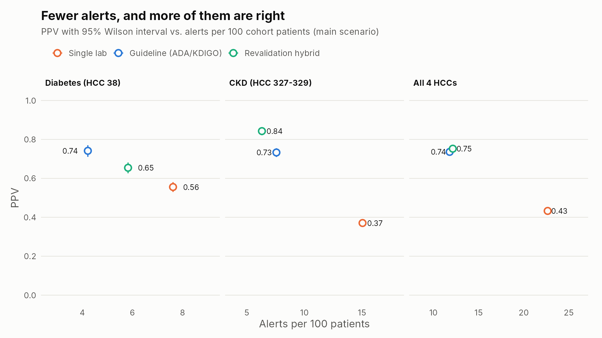
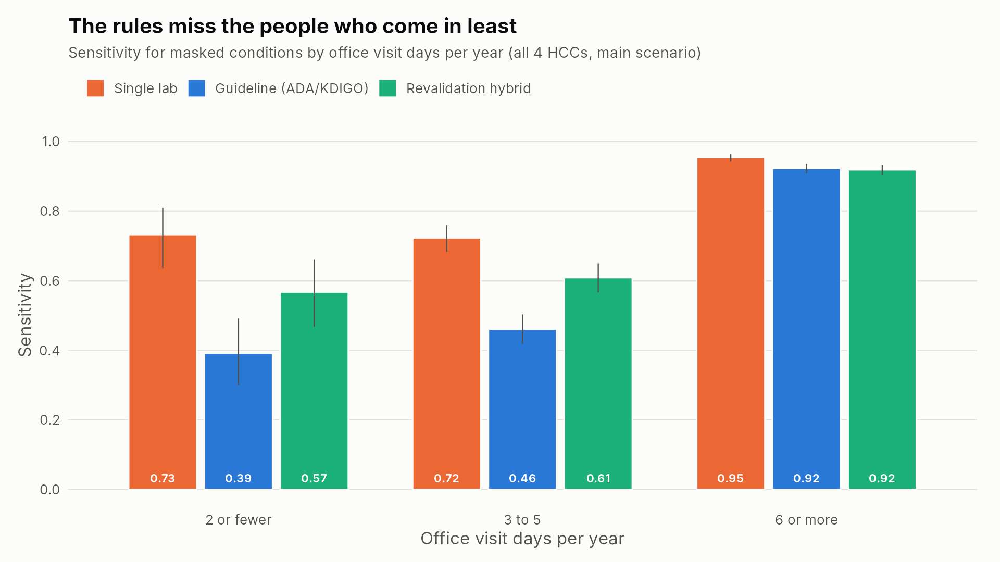

# Undocumented chronic condition detection in synthetic and real EHR data

Medicare Advantage risk scores only count conditions that get coded each year. A patient with diabetes or stage 3 CKD whose condition never makes it onto a claim this year is sicker than the plan's data says, and they may be missing care too. Lab results often show the condition anyway.

This project builds and tests lab rules for four CMS-HCC V28 categories, using a synthetic Medicare-age population where the right answer is known. The same kidney rule is then run on real hospital data from MIMIC-IV. Everything runs on PostgreSQL and R.

| HCC | What it is | V28 coefficient | Lab signal |
|---|---|---|---|
| 38 | Diabetes | 0.166 | HbA1c (ADA) |
| 329 | CKD stage 3a | 0.127 | eGFR 45 to 59 (KDIGO) |
| 328 | CKD stage 3b | 0.127 | eGFR 30 to 44 |
| 327 | CKD stage 4 | 0.514 | eGFR 15 to 29 |

## What came out of it

**Data.** 20,000 synthetic North Carolina patients aged 65+ from Synthea, 55.8 million EHR records in PostgreSQL, and a cohort of 19,521 patients after applying the criteria. The SNOMED CT to ICD-10-CM to V28 crosswalk covers 100% of the 146,394 chronic condition records. 27% of those land in a V28 payment HCC.

**Synthea's own labs couldn't test lab rules fairly.** Five problems were traced back to specific Synthea modules:
- 56% of true diabetics' HbA1c results are under 4.0%.
- Two unrelated modules hard-code creatinine at 2.5 to 3.5 mg/dL.
- Coded CKD stage doesn't match the creatinine values.
- Kidney disease in people without diabetes gets labeled "due to diabetes".
- 27% of prediabetic patients are on insulin.

On raw values, the CKD rule had a sensitivity of 1.00 and a PPV of 0.12. The lab values were replaced with a documented model: each patient's true level, published biological variation, AKI spikes in the hospital, and missing tests calibrated to Medicare testing rates.

**Main results** (19,521 patients, masked documentation for 27.6% of diabetes and 51% of stage 3 to 4 CKD):

| Rule | Alerts per 100 | PPV (95% CI) | Sensitivity | Masked RAF recovered | RAF on false alerts |
|---|---|---|---|---|---|
| Single lab | 22.7 | 0.43 (0.42 to 0.45) | 0.89 | 91% | 426.9 |
| ADA / KDIGO guideline | 11.8 | 0.74 (0.72 to 0.75) | 0.79 | 83% | 89.4 |
| Revalidation hybrid | 12.1 | 0.75 (0.73 to 0.77) | 0.83 | 86% | 89.9 |

- **CKD.** The hybrid reaches PPV 0.84 (0.82 to 0.86) at 6.3 alerts per 100, vs 0.73 for KDIGO alone and 0.37 for a single low eGFR.
- **Diabetes.** The hybrid's drug path is undercut by Synthea's insulin-for-prediabetes records, giving PPV 0.65 vs 0.74 for the ADA rule. With those records removed (sensitivity analysis), the hybrid reaches 0.78 PPV at 0.70 sensitivity, and the four-HCC hybrid reaches 0.81 (0.80 to 0.83).
- **Access gap.** Hybrid sensitivity is 0.57 for patients with 2 or fewer office visit days a year, vs 0.92 for those with 6 or more. People who come in less get tested less, so they get found less.
- **PPV is not a fixed property of a rule.** Holding the rules and labs fixed and only changing the share of true cases hidden, hybrid PPV moves from 0.44 at 10% masked to 0.83 at 60%.

**Reproducibility.** The rules are written separately in SQL and in R. They agree on 100% of 78,084 patient-by-HCC pairs in every scenario. 34 unit tests (91 checks) cover the eGFR equation, staging boundaries, rule edge cases, masking, the crosswalk, SQL vs R parity, and the MIMIC script. Two real bugs were caught by tests before the full run. One was PostgreSQL typing `0.9938` as exact `numeric`, so SQL eGFR differed from R in the last bits. The other was a data.table empty-group crash.

**Real data (MIMIC-IV).** `mimic/run_mimic_ckd.R` applies the KDIGO rule to the open MIMIC-IV demo (100 real, de-identified hospital patients):
- 20 patients meet the KDIGO lab definition.
- 5 of those 20 (25%, 95% CI 11% to 47%) have no CKD code anywhere in their record.
- All 5 carry an acute kidney injury code, which is exactly the confusion the hybrid rule targets. The outpatient-only hybrid keeps 2 of them.

The 5 are written to a review packet with blank columns for a nephrologist. With n = 20, read this as a working check on real data structure, not a prevalence estimate. Outputs are in `mimic/output/`.




## Running it

You need PostgreSQL 14+, R 4.1+ (packages: data.table, DBI, RPostgreSQL, ggplot2, testthat, scales), and Java 17+ for Synthea.

```bash
# 1. a database and a user
createdb ehr
export PGHOST=localhost PGUSER=ehr PGDATABASE=ehr PGPASSWORD=...   # whatever you set up
psql -c "ALTER DATABASE ehr SET timezone TO 'UTC'"

# 2. Synthea
mkdir -p synthea
curl -L -o synthea/synthea-with-dependencies.jar \
  https://github.com/synthetichealth/synthea/releases/download/master-branch-latest/synthea-with-dependencies.jar

# 3. generate and load (about 2 hours for 20 batches on 2 cores; N_BATCHES=2 for a quick test)
scripts/build_database.sh

# 4. the analysis, tables, figures, and tests (about 3 minutes)
scripts/run_pipeline.sh

# 5. optional: the real-data check
Rscript mimic/run_mimic_ckd.R mimic/data/mimic-iv-clinical-database-demo-2.2
```

The Synthea jar is a rolling build, so a newer one can give slightly different patients from the same seed. The numbers above came from build `d9d07a6` (August 18, 2026); to match them exactly, build Synthea from that commit. Every number above comes from the files in `output/tables`.

## Layout

```
config/       study parameters and lab model parameters, each with a source or reason
reference/    the SNOMED to ICD-10-CM crosswalk and the CMS V28 files
sql/          schema, loader, cohort, crosswalk, truth, lab draws, SQL rules
R/            masking, lab model, R rules, evaluation, reconciliation, figures
tests/        testthat suite and a made-up six-patient MIMIC-format fixture
mimic/        MIMIC-IV script, review packet scorer, instructions, and the demo run's output
scripts/      build_database.sh and run_pipeline.sh
docs/         methods, decision log, data dictionary
output/       tables (csv) and figures (png) from the last run
```

`docs/methods.md` has the full method and its limitations. `docs/decision_log.md` records what broke and why things are the way they are.

## Limits

The main numbers come from a simulation. They show how these rules behave relative to each other under realistic noise and missing tests. They are not an estimate of how the rules would do at a real health plan. Masking is random, but real undocumented cases are probably milder and seen less often. CKD is less common in Synthea than in real older adults, and CKD sensitivity near 1 is a property of the lab model. The crosswalk was built by one person without the licensed NLM map. More in `docs/methods.md`.

## Data and credits

- Synthea: The MITRE Corporation, Apache 2.0. https://github.com/synthetichealth/synthea
- CMS-HCC V28 2026 midyear/final mappings and model software: CMS, public domain.
- MIMIC-IV Clinical Database Demo v2.2: Johnson A, Bulgarelli L, Pollard T, Horng S, Celi LA, Mark R. PhysioNet. Open Data Commons Open Database License v1.0.
- Code in this repo: MIT license.
